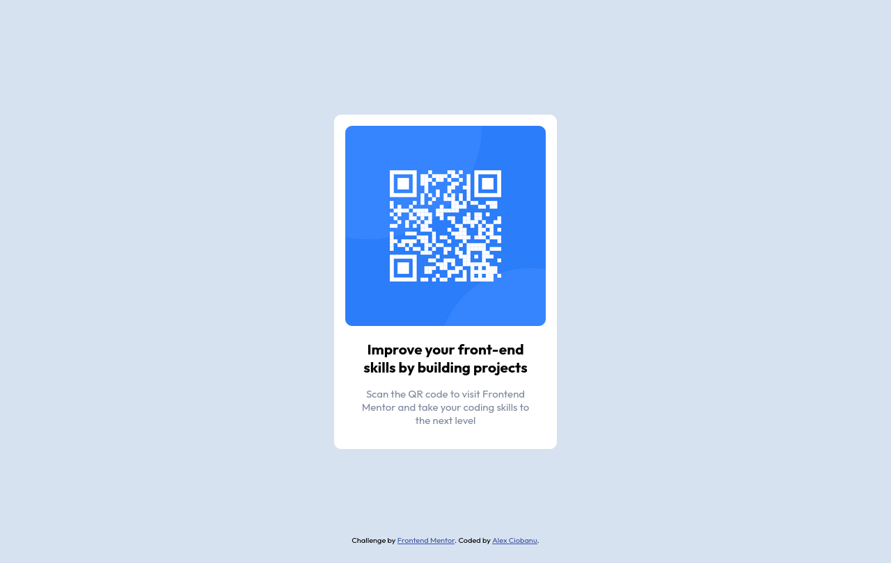

# Frontend Mentor - QR code component

This is a solution for the QR Code component challenge on Frontend Mentor.

## Table of contents

- [Screenshots](#screenshots)
- [Links](#links)

## Screenshots

Mobile view:

Desktop view:

## Links

[Github repository](https://github.com/AlexCiobanu47/QR-Code-component)

[Live site](https://alexciobanu47.github.io/QR-Code-component/)
